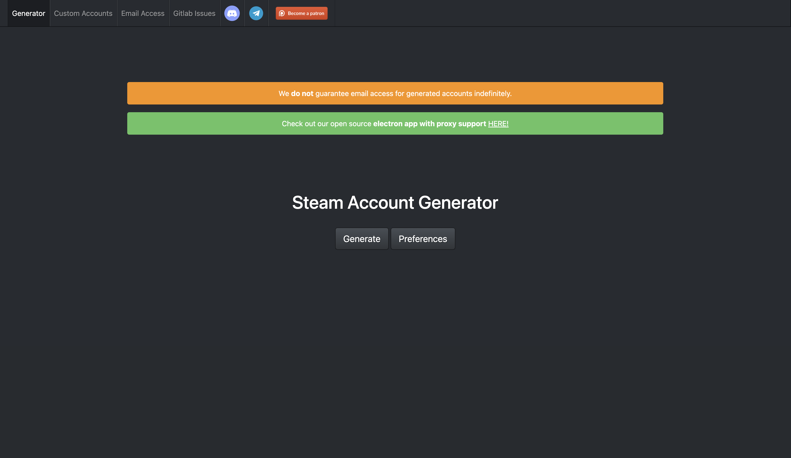
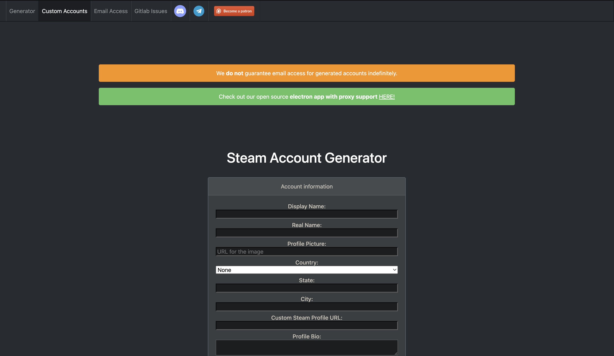

<!-- 
ACCGEN COPYRIGHT TO NULLWORKS,
  All files and newly created files are all owned by nullworks 
  if they ever decide to bring back accgen this website will be liable for
  shutdown since it's practically a copy of accgen.

  Legal Team: Nullworks,   Archive Owner: IWiso
-->
<h3> About accgen </h3>
<h6> 
   Accgen is an account generator website usually called SAG(Steam Account Generator) but we'll stick with accgen for now.
     
  Accgen was created by nullworks for automation in making steam accounts without the hassle of all the account setup (except profile editing) which was primary used by bot hosters but some legits also used it aswell, i came here to make this because i knew they would do this from personal talks with bencat and other developers and it was obvious they were getting tired of constant support to the website.
    
  Thankfully i copied the website in-time before anything like the shutdown happened so now you are here seeking refuge because a simple website is now down lmao.
</h6>
<h3> Any ideas? </h3>
<h6>
  i got no clue what someone could do to bring this back which is why i did my best to not mess with much from there website (meaning you can edit it like the day the website still existed) altho be warned files have been moved and some stuff has been changed to meet standard requirements for ya know <i>copying an entire copyrighted website</i>
</h6>
<h3> Accgen Gallary </h3>

<b>
  Copyright: &copy;Nullworks, Cathook, All Developers who supported accgen's development.
</b>

